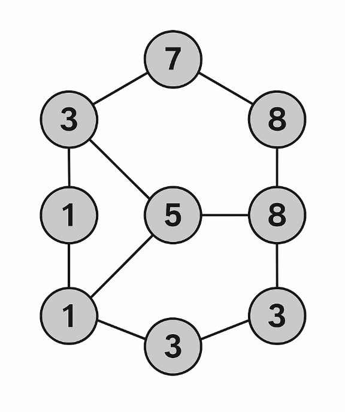

# Graph Puzzle Game

This is a graph-based strategy puzzle game where players are challenged to maximize their score by smartly traversing nodes and edges under specific constraints. Each node in the graph holds a point value, and each edge can only be used **once** per submission — can you find the optimal path?

---

## Game Objective

Traverse the graph in such a way that you collect the **maximum possible score**, visiting each edge at most once. Strategy, pattern recognition, and optimization are key to climbing the leaderboard.

  

---

## Game Modes

### 🗓️ Daily Challenge
- A new graph is generated every day.
- Players get **5 submissions max** to discourage brute-force solving.
- Track your speed with a built-in timer and compare **Points Per Second**.
- A **leaderboard** displays top scores and fastest times from the previous day.
- Next-day analysis includes:
  - Most common paths
  - Average player scores
  - Optimal solution insights

### 📈 Training Mode
- AI assigns each graph a **difficulty rating** based on:
  - The gap between average player score and optimal score.
- Your **personal rating** evolves based on performance.
- Gradually escalates difficulty to help you improve over time.

### 🏅 Standard Mode
- Solve graphs continuously and accumulate points.
- Players are ranked within **divisions** based on their rating.
- Focuses on consistency and skill over time.

### 🛠️ Community Mode
- Create and share your own graph challenges.
- Solve puzzles made by others and see how you stack up.
- Upvote the most interesting and challenging community maps.

---

